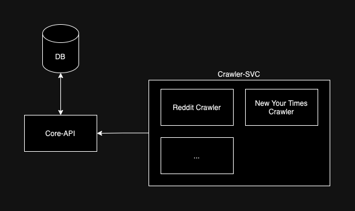

# elephant-crowler


## Development
To start contributing this repository:

1. Install requirements:
```
python -m pip install -r requirements.dev.txt
```

2. Install pre-commit hook:
```
pre-commit install
```

You're good to go!

### Architecture


1. DB stores all data from the texts.
2. Core-API provides access to the database for the external services.
3. Crawler-SVC starts all


## Deployment

Only thing you need to do is:
```
docker-compose up --build
```

Then all scrapped texts are available on the endpoint:
```
http://localhost:8081/scrapped-texts
```
